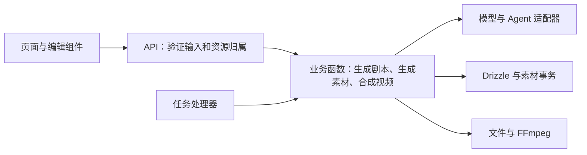

**AIComicBuilder 软件工程审查，2026-09-24**

结论：项目需要有针对性的架构优化。Next.js、SQLite、Zustand 和现有服务商适配器足以支撑当前形态。主要维护成本来自重复的业务实现、混用的项目与分集状态，以及没有完成迁移的素材模型。优化应围绕消除重复、明确数据归属和保证写入完整性展开。

审查基于 `e01e7dd`，覆盖 API、数据库及迁移、前端状态、生成流程、任务队列、模型适配、视频合成、依赖和构建配置。验证使用独立临时数据库和生成的测试素材；外部 AI 响应使用替身，没有调用付费生成服务。本文将已完成的修复与后续问题分别标明。

用户确认先修复的四项问题已经完成：

| 问题 | 修改后的行为 | 验证 |
| --- | --- | --- |
| 视频加转场后丢失音轨 | 转场同时处理画面和声音；无声片段按实际时长补静音；有声片段统一采样格式；使用实际视频时长确定转场位置 | 14 种 FFmpeg 组合通过，检查总时长、音轨、静音区间及各片段的声音频率；包含全部 6 种非硬切转场、两种硬切混合顺序、不同采样率和请求时长与素材不符的情况 |
| 下载素材返回 404 | 前端使用带用户标识的 `apiFetch` 获取 ZIP，并提供下载中状态和失败提示 | 浏览器实际点击下载，校验 ZIP 完整性；模拟失败后可以重试 |
| 分镜页手机端横向溢出 | 页头操作换行；镜头摘要在窄屏独占一行，时长和转场控件按宽度换行 | 四种语言分别检查 320、390、768、1440 像素；另检查两种生成模式、展开内容、看板和编辑抽屉，无页面横向溢出 |
| Next.js 已知安全漏洞 | `next` 和 `eslint-config-next` 从 16.1.6 升级到 16.3.6，并更新锁文件 | 生产构建通过；更新后的依赖审计中没有 Next.js 条目 |

下载接口同时修正了内容范围：验证分集和版本属于当前项目，只打包该版本的活动素材、该分集关联角色的图片和该分集成片。素材直接读取 `shot_assets`，去除了此接口对旧素材字段视图的依赖。打包前检查真实文件路径，排除上传目录之外的文件和指向目录外的符号链接；这些情况均已用独立数据库验证。

Next.js 升级覆盖官方公布的 AVIF 图片优化严重漏洞，官方列出的修复版本为 16.3.3。相关依据见 [Next.js 官方安全公告](https://github.com/vercel/next.js/security/advisories/GHSA-2xp9-vwfh-vxw4)。依赖审计仍有其他包的报告，包括 `@google/genai` 引入的 `protobufjs` 严重公告；本次没有证明该依赖问题在应用中的可利用性，也没有将全项目依赖审计记为通过。

**优先处理的数据和访问问题。** 以下发现仍需要后续修复。这里的高优先级指能够破坏已有数据、修改其他项目资源或读取目录外文件的问题。

1. **升级数据库会丢失原有素材映射。** [0050 迁移](../drizzle/0050_add_shot_assets.sql) 只建立新表，[0051 迁移](../drizzle/0051_drop_legacy_shot_columns.sql) 随即删除旧素材列，没有把素材路径和提示词搬入新表。验证时，从 0049 的数据库写入首帧、尾帧和视频路径再升级，镜头仍存在，素材表却为零行，旧列也已删除。应在删除旧列之前完成一次性数据迁移，并用有历史数据的数据库验证；已经执行删除的数据库需要从备份恢复相关数据。

2. **迁移编号与时间顺序不一致，旧库跳过 Agent 表。** [_journal.json](../drizzle/meta/_journal.json#L369) 的 0052、0053 时间值小于 0051。Drizzle 按时间判断待执行迁移；从旧库升级后只记录了 52 次迁移，缺少 `agents` 和 `agent_bindings`，而新建库完成 54 次迁移。新建库成功不能代替升级验证。修复时需要同时覆盖已经记录到不同阶段的数据库。

3. **部分生成操作没有校验子资源归属。** [生成入口](../src/app/api/projects/[id]/generate/route.ts#L179) 校验 URL 中的项目属于请求用户，但处理传入的 `episodeId`、`shotId` 时没有一致地约束项目归属。用自己的项目 URL 携带另一项目的分集 ID，返回 400 前已改写对方的创意；携带另一项目的镜头 ID，替身图片生成返回 200 并改写对方素材。入口应一次确定项目、分集、版本和镜头的所属关系，再执行操作。

4. **Agent 绑定接口没有用户及归属校验。** [agent-bindings/route.ts](../src/app/api/projects/[id]/agent-bindings/route.ts#L7) 的 GET、PUT 不检查项目所有者，PUT 也不验证 Agent 所有者。未带用户标识的请求已复现读取、修改绑定成功。应在读写前验证项目和 Agent 同属当前用户。

5. **素材文件接口的目录判断可以越过目录边界。** [uploads/route.ts](../src/app/api/uploads/[...path]/route.ts#L23) 使用字符串前缀判断路径，允许访问名称以 `uploads` 开头的相邻目录。已通过 HTTP 读取临时相邻目录中的标记文件。下载 ZIP 的同类问题已修复，直接读取文件的这个入口仍需改用目录边界和真实路径检查。

6. **角色提取失败会提前清空分集角色。** [生成入口的角色提取](../src/app/api/projects/[id]/generate/route.ts#L664) 在检查模型配置及取得 AI 结果之前删除关联。缺少模型时返回 400，原有的一条角色关联已变成零条。应先获得并验证结果，再用短事务一次替换关联；外部 AI 调用应在事务之外。

**其他已复现的问题及其设计原因。** 下表记录的是后续工作，不属于本次已完成的四项修复。

| 问题 | 复现或直接依据 | 应调整的设计 |
| --- | --- | --- |
| 预览页丢失分集上下文 | [preview/page.tsx](../src/app/[locale]/project/[id]/episodes/[episodeId]/preview/page.tsx#L33) 带版本进入时调用 `fetchProject(id, undefined, versionId)`；实际合成请求的 `episodeId` 为 `null`，成片写回项目而非分集 | 从路由明确传入分集 ID；项目与分集状态独立 |
| 手动上传首尾帧失败 | [upload/route.ts](../src/app/api/projects/[id]/shots/[shotId]/upload/route.ts#L54) 仍更新已删除的 `shots` 素材列；有效 PNG 上传产生 SQL 语法错误 | 上传、生成、清空统一使用素材操作 |
| 清空首帧后数据仍存在 | 前端删除该项后提交剩余数组，[assets/route.ts](../src/app/api/projects/[id]/shots/[shotId]/assets/route.ts) 只遍历提交中出现的类型；被清空的类型不参与删除，响应仍为 200 | 使用明确的删除操作，或者明确指定要替换的类型并允许空数组 |
| 重新生成首尾帧不保留历史 | 连续生成两次仍只有两行素材，版本均为 1，路径被覆盖 | 生成成功调用新增版本操作；修改提示词与新增生成结果分开 |
| 并发生成产生重复活动版本 | [insertAssetVersion](../src/lib/shot-asset-utils.ts#L149) 的读版本、停用旧行、新增行没有事务；同时插入可得到两条版本 1、均活动的记录 | 同一素材位置的版本变更使用事务，并设置必要的唯一约束 |
| 分镜拆分部分失败被当作成功 | 9 个场景分为两批，模拟第二批解析失败，接口仍返回 200 并保存只含第一批结果的版本 | 明确整批失败或部分成功的结果结构；不得用空数组掩盖失败 |
| 仅配置 Agent 时前端拦截生成 | 分集已绑定 Agent，本地没有文本模型，点击生成剧本不会请求后端，提示先配置模型 | 界面根据实际执行配置判断能力，或由同一业务校验返回缺失配置 |
| Dify 流式文本重复 | [agent-caller.ts](../src/lib/ai/agent-caller.ts#L149) 同时输出文本增量和每个完成节点的文本；模拟工作流得到三份相同结果 | 文本增量与最终结果选择清晰的输出规则；中间节点不作为最终回答 |
| Gemini 自定义地址未生效 | [ai-sdk.ts](../src/lib/ai/ai-sdk.ts#L22) 忽略 `baseUrl`；拦截请求后观察到仍访问默认地址 | 配置与调用共享一个协议定义，用替身请求验证目标地址 |
| 图片适配器拒绝有效的 Base64 返回 | [providers/openai.ts](../src/lib/ai/providers/openai.ts#L81) 只读取 `url`；模拟 SDK 定义中的 `b64_json` 响应得到“无图片 URL”错误 | 将服务商返回解析收敛到适配器，向业务返回统一的本地素材路径 |
| 删除中间镜头后部分字幕消失 | [generateSrtFile](../src/lib/video/ffmpeg.ts#L86) 将 `shotSequence - 1` 当数组下标；保留序号为 1、3 的两个镜头时，第 3 镜字幕被跳过 | 字幕使用合成时的镜头索引或镜头 ID；字幕时间也应使用包含转场重叠的实际时间线 |
| 生产环境反复建立数据库连接 | [db/index.ts](../src/lib/db/index.ts#L24) 只在非生产环境缓存连接与 Drizzle 实例；生产模式连续访问会建立不同连接 | 每进程复用一个 SQLite 连接和实例；初始化与迁移各有明确入口 |
| 定时任务立即执行，运行中任务无法恢复 | [queue.ts](../src/lib/task-queue/queue.ts#L34) 将按秒存储的时间与毫秒比较；安排到明天的任务被立即领取；运行中任务重启后没有恢复路径 | 统一时间单位；如果继续使用队列，补齐认领、超时和恢复规则 |

任务的定时字段目前没有找到前端调用点，属于已验证的队列缺陷；不应将其描述为当前每次生成都会失败。服务商问题使用模拟响应验证，没有验证所有真实服务商账户、网络和配额行为。

**代码为什么需要调整。** 项目约三万行源码，规模本身并不需要复杂基础设施。下列几个集中点已经让局部改动难以推断影响。

| 当前结构 | 对阅读和修改的影响 | 建议 |
| --- | --- | --- |
| `generate/route.ts` 约 3,895 行，同时处理请求、权限、提示词、外部调用和落库 | 看一个生成动作需要跟踪多个职责，批量与单项实现容易不同步 | 按剧本、角色、分镜、素材生成、成片拆出普通业务函数；路由只处理请求、校验和响应 |
| `lib/pipeline` 与 API 内部另有一套生成实现 | 同一能力有不同参数、素材读写和错误处理，修复容易只覆盖一个入口 | 入口与任务处理器调用同一份业务函数；删除重复实现；未知动作直接返回错误 |
| 分集接口把分集数据改造成项目形状，`project-store` 用同一变量接收两种响应 | 读代码时不能从类型判断数据属于项目还是分集，导航会改变后续请求的目标 | 明确 `Project` 和 `EpisodeDetail`；用路由参数作为编辑范围，并在请求中显式传递 |
| `shot_assets`、`ShotLegacyView`、旧字段上传接口及前端转换同时存在 | 每个新功能都要猜应该读写哪种表示，数据库与界面历史版本含义不一致 | 完成所有调用点迁移，统一素材类型和操作，然后删除旧视图与重复转换 |
| 分镜页约 1,211 行、镜头卡片约 1,497 行，混有生成请求、批处理、进度、编辑和展示 | 同一屏幕的异步状态互相影响，组件难以独立理解和验证 | 提取批量执行逻辑；按页头操作、版本选择、生成控制、镜头列表拆分；卡片保留镜头自身展示与编辑 |
| 提示词注册文件约 2,010 行 | 内容修改与注册结构混在一起，定位用途费时 | 按剧本、角色、分镜、图片、视频拆分内容文件，保持一个简单入口汇总 |

建议保留现有单体部署，在内部形成下面的直接调用关系。这里的业务函数可以直接使用 Drizzle 和现有适配器，不必为每一层增加接口、基类或工厂。

例如，“生成第 2 集第 3 个镜头的首帧”应只有一条业务路径：API 校验用户和镜头归属，业务函数读取该分集、版本及镜头，构造提示词并调用图片适配器，生成成功后在事务里新增素材版本。批量生成只循环调用这个函数并汇总每项结果；任务队列也调用它。这样重新生成是否保留历史、失败是否修改旧结果，只需在一个地方确定。

接口应直接表达业务范围，例如 `generateFrame({ projectId, episodeId, versionId, shotId, frame })`。不要在函数执行到一半时再读取可变的全局“当前分集”。对于分集页面，分集 ID 应为必填；项目级操作使用自己的接口，避免大量 `episodeId ? ... : ...` 分支。数据库迁移使用一次性的升级脚本，应用代码只保留当前数据模型。

短请求可以由 API 直接执行。需要跨刷新或进程重启继续运行的视频任务，完成恢复机制后再接入现有队列；任务状态、批量进度和结果应有一致的定义。当前证据支持先统一执行函数与修复 SQLite 队列，还不足以要求引入 Redis、微服务或工作流框架。

**验证和交付流程也需要补齐。** 原代码全量 ESLint 有 18 个错误、80 个警告；升级规则后有 39 个错误、81 个警告，新增报告主要来自已有组件的 React Hooks 用法。本次新写的 FFmpeg 和下载 API 通过针对性 ESLint，生产构建通过，但不能将全项目 lint 写成通过。分镜页仍有条件调用 Hook 的既有错误，需要在组件拆分中消除。

仓库没有测试脚本，现有 GitHub 工作流只构建和发布 Docker。建议首先增加能够验证历史数据升级、资源归属、素材版本事务的少量集成测试，使用真实临时 SQLite；服务商适配使用固定响应验证输入输出；视频合成保留短素材的 FFmpeg 回归。纯样式和文案调整按实际影响验证，不需要每次跑全部测试。CI 至少运行类型检查、可执行的 lint 和这些关键测试，依赖更新另跑生产构建。

同时固定 Node 与 pnpm 版本：README 的 Node 18 要求与当前运行依赖不一致，Docker 中的 `pnpm@latest` 也会改变安装行为。`shadcn` 是开发工具，应评估移出运行时依赖，减少生产镜像中无用的包。无需为了这些调整引入新的包管理或构建体系。

建议按下面的顺序实施，每一步都应形成可验证的小范围提交：

1. 先修复迁移、子资源归属和失败时的数据破坏，建立对应的回归测试，并明确 SQLite 连接生命周期。
2. 完成素材模型迁移，让上传、生成、删除、版本切换共用明确的操作；整理事务与唯一约束，删除旧字段视图。随后让路由和任务处理器复用同一份生成函数。
3. 分离项目与分集状态，明确所有请求的编辑范围；拆出批量执行逻辑和真正有独立职责的组件，修复 Hook 顺序错误。
4. 按实际使用场景补齐队列恢复、服务商响应校验及视频时间线；继续清理 lint 和依赖审计问题。

优化是否有效，应通过行为和代码同时判断：同一种素材的生成只有一个实现；页面切换不会改变已经发出的操作范围；失败不会破坏已有数据；升级能够保留历史素材；查看一个业务函数即可知道它读取什么、调用什么以及何时保存结果。
