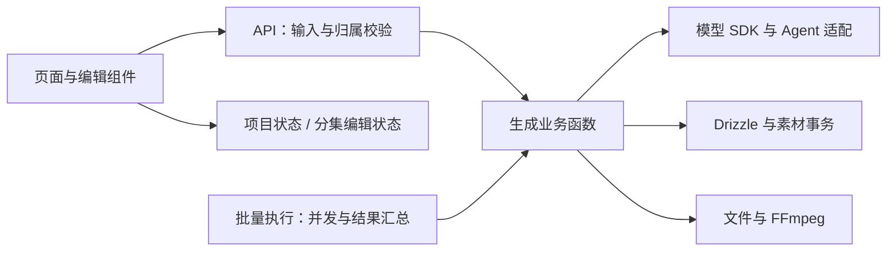

**AIComicBuilder 软件工程审查与整改，2026-09-24**

项目需要优化内部职责和数据一致性，现有 Next.js 单体、SQLite、Drizzle 和 Zustand 可以继续使用。本次已落实审查建议：统一生成逻辑与素材模型，分开项目和分集状态，移除重复实现和旧接口，补上数据迁移、失败回滚、服务商适配和视频合成的验证。没有引入微服务、Redis 或额外的工作流平台。

审查起点为 `e01e7dd`，覆盖 API、数据库迁移、前端状态、生成流程、模型与 Agent 适配、媒体处理、依赖和构建。最初四项修复位于 `fix/review-findings`；后续整改位于 `refactor/project-architecture`，以该修复分支为基础。本文记录最终实现；历史问题的描述不代表整改后的行为。

**维护范围**

只维护当前软件接口、AI 结果格式和数据库模型。调用方与接口同时更新，不保留旧字段视图、旧动作别名、旧模型配置转换、旧结果包装或第二套生成实现。数据库升级使用一次性的向前迁移，应用运行时只读写当前结构。

分镜版本、素材历史版本、提示词版本是用户创作数据，继续保留。它们与“同时维护多个软件版本”是不同的概念。重新生成素材新增版本，编辑提示词只修改该版本的元数据，切换历史版本只调整活动标记。

**已处理的问题**

| 原问题 | 现在的行为与实现 |
| --- | --- |
| 视频加入转场后丢失音轨 | 所有转场同时处理画面和声音，无声片段补静音，有声片段统一采样格式；硬切也统一处理不同来源的片段 |
| 字幕把镜头序号当数组下标，删除镜头后漏字幕 | 使用实际参与合成的片段索引；根据 FFprobe 的真实时长和转场重叠计算字幕时间 |
| 背景音乐覆盖对白，短音乐可能截短成片 | 背景音乐循环播放并与原音轨混合，输出以视频真实时长为准 |
| 素材下载返回 404 | 下载使用携带用户标识的 `apiFetch`，显示下载状态和失败原因；ZIP 按分集、分镜版本和活动素材打包 |
| 手机端分镜页横向溢出 | 页头、镜头摘要和操作区按宽度换行；验证列表、看板、展开内容和抽屉 |
| 0050 建表后直接删除旧素材列 | 先将原素材路径、提示词和参考图写入 `shot_assets`，再移除旧列 |
| 0052、0053 迁移时间倒序，旧库跳过 Agent 表 | 修正迁移顺序，使用标准 Drizzle 迁移器，覆盖新库与历史数据库升级 |
| 生成操作可携带其他项目的子资源 ID | 入口统一验证项目、分集、分镜版本、镜头、角色和参考素材的归属后再调用业务函数 |
| Agent 绑定不检查项目和 Agent 所有者 | GET、PUT 按当前用户标识验证双方归属 |
| 上传目录边界判断允许相邻目录或符号链接越界 | 文件读取和 ZIP 共用真实路径检查，排除目录外文件和目录外符号链接 |
| 角色提取失败提前清空旧角色关联 | 先获取并校验完整结果，再用短事务更新角色、关联和关系 |
| 手动上传首尾帧写入已删除的镜头列 | 上传直接创建素材版本，与生成结果使用相同存储操作 |
| 清空首帧返回成功但数据库未清除 | 替换接口显式指定 `type`，允许空 `items`；停用该类型的活动素材，保留其他类型和历史 |
| 重新生成首尾帧覆盖原路径 | 新增版本；一对首尾帧全部生成成功后在事务中保存，失败保留原结果 |
| 并发写入产生重复版本和多个活动版本 | 版本插入、切换使用事务；数据库约束保证每个位置的版本唯一、活动记录唯一 |
| 分镜拆分某批失败仍保存残缺版本 | 所有批次成功且符合当前格式后，一次事务写入版本、镜头和对白；失败不产生新版本 |
| 参考图提示词生成失败损坏原结果 | 全部提示词先验证，之后一次保存；成功时也保留旧素材历史 |
| 预览页丢失分集上下文 | 从路由传入分集 ID 和选择的版本；合成也传入实际预览的生成模式 |
| 切换分集后旧请求覆盖新页面 | 项目和分集存储分离；响应只更新对应编辑范围，旧响应不能覆盖新的分集 |
| 自动保存使用变化后的“当前分集” | 防抖保存携带编辑发生时的分集快照，离开页面时刷新待保存内容 |
| 两个提示词保存相互覆盖 | 元数据编辑 PATCH 对应素材，只发送变化字段；增删使用明确的类型替换接口 |
| 仅配置 Agent 时前端仍要求文本模型 | 能力检查读取项目的 Agent 绑定，允许直接使用已绑定 Agent |
| Dify 流式文本重复输出 | 使用 `eventsource-parser` 处理 SSE；输出文本增量，未收到增量时才使用工作流最终结果，不输出中间节点结果 |
| Gemini 自定义地址未生效 | SDK 接收配置中的 `baseURL`，验证请求确实发往配置地址 |
| OpenAI 图片适配器拒绝 Base64 结果 | 接受 SDK 的 `b64_json` 或 URL，统一保存为本地素材路径 |
| 剧本流式保存失败只打印日志 | Agent 和普通模型共用流式保存流程；流中断不覆盖已保存文本，写入失败传给响应消费者 |
| 一键生成继续操作旧版本，失败后仍调用后续步骤 | 新建分镜返回 `versionId`，后续请求固定使用该版本；某一步失败即停止 |
| 版本对比两侧显示同一份占位数据 | 两侧分别读取所选版本，使用 SWR 缓存，不修改编辑器当前版本 |
| 生产模式重复打开数据库连接 | 每个进程复用一个连接，启用 WAL 和外键约束；初始化与迁移职责分开 |
| 未接入界面的任务队列时间单位错误、运行状态无法恢复 | 删除未使用的队列、任务 API、任务表与重复 pipeline；未知动作直接报错 |
| 依赖包含已知漏洞和未使用的运行包 | 更新依赖锁文件，删除运行时 `shadcn` CLI 和未使用的 `pdfjs-dist`；PDF 只使用 `unpdf`；约束 Drizzle Kit 间接引入的 esbuild 到已修复版本，并验证迁移生成命令 |

**当前架构**

以“生成第 2 集第 3 个镜头的首尾帧”为例：路由验证资源归属，帧生成函数读取当前提示词和角色素材，调用图片适配器，得到两张图片后用事务插入新版本。批量生成调用同一函数，只负责并发控制、跳过已完成项和汇总每项结果。

| 职责 | 代码入口 | 约束 |
| --- | --- | --- |
| HTTP 请求和统一错误响应 | [generate/route.ts](../src/app/api/projects/[id]/generate/route.ts)、[request.ts](../src/lib/generation/request.ts) | 路由不实现生成业务，未知动作和无效参数直接拒绝 |
| 剧本、角色、分镜、图片、视频和成片 | [generation/](../src/lib/generation/) | 外部调用在事务外；AI 结果通过 Zod 校验后保存 |
| 素材类型与读写 | [shot-assets.ts](../src/lib/shot-assets.ts)、[shot-asset-utils.ts](../src/lib/shot-asset-utils.ts) | 只有 `shot_assets` 一种表示，不返回旧字段视图 |
| 项目与分集状态 | [project-store.ts](../src/stores/project-store.ts)、[episode-editor-store.ts](../src/stores/episode-editor-store.ts) | 编辑请求显式携带范围，不在异步完成时重新寻找“当前分集” |
| 批量生成、镜头编辑与展示 | [use-batch-generation.ts](../src/hooks/use-batch-generation.ts)、[use-shot-editor.ts](../src/hooks/use-shot-editor.ts)、[shot-card.tsx](../src/components/editor/shot-card.tsx) | 批量执行、保存与界面展示各自集中；条件返回不改变 Hook 调用顺序 |
| 提示词定义 | [prompts/registry.ts](../src/lib/ai/prompts/registry.ts)、[prompts/definitions/](../src/lib/ai/prompts/definitions/) | 注册入口只汇总；内容按剧本、角色、分镜、图片、视频分类 |
| 合成时间和音视频处理 | [video/timeline.ts](../src/lib/video/timeline.ts)、[video/ffmpeg.ts](../src/lib/video/ffmpeg.ts) | 使用实际片段时长，画面转场、音轨和字幕共享同一时间计算 |

直接复用已有工具：Zod 负责数据校验，Drizzle 负责迁移和事务，`p-map` 控制并发，SWR 处理请求缓存，`use-debounce` 处理延迟保存，`eventsource-parser` 解析 SSE，AI SDK 和服务商 SDK 处理协议，FFmpeg / FFprobe 处理媒体。没有再实现一套验证器、请求缓存或任务调度器。

**验证与开发要求**

本次交付检查：41 项自动测试通过；`pnpm lint --max-warnings 0` 和类型检查通过；生产构建通过；全量依赖审计（含开发依赖）为零报告。浏览器检查通过以下列出的布局和编辑流程，包含一键生成的新版本传递与失败后停止。依赖审计反映检查时的公开公告，不代表未来不会出现新的公告。

- Node 24.15 和 pnpm 10.11 已在 `.nvmrc`、`package.json`、Dockerfile 和 CI 中固定。依赖由锁文件确定，部署使用 `pnpm install --frozen-lockfile`。
- CI 执行 ESLint（零警告）、TypeScript、Vitest 和生产构建。编辑器原始素材预览明确使用原生图片标签，这一范围关闭 Next 图片优化建议；其他 lint 和可访问性检查保持启用。
- 自动测试使用独立临时 SQLite，覆盖新建与升级、归属检查、路径边界、素材版本约束、清空和上传、AI 部分失败、事务回滚、流中断、分集请求竞争、服务商响应、PDF 导入以及真实 FFmpeg 合成。
- 视频测试生成短片段并执行 FFmpeg / FFprobe，检查全部七种转场类型、字幕起点、时长、音轨及混音中的音频频率，不只检查命令字符串。
- 浏览器检查使用临时项目和素材，覆盖四种语言、320 / 390 / 768 / 1440 像素、列表、看板、抽屉、下载、上传、清空、编辑、版本对比、预览上下文和 Agent 配置。
- 外部 AI 使用固定响应验证，没有调用真实付费账户。账户权限、配额和服务商线上行为不在这些结果的保证范围内。

迁移前需要保留数据库和上传目录的备份。尚未执行旧 0051 的数据库能够在升级时搬迁素材；已经被旧版 0051 删除的字段无法从现有数据库还原，必须从备份找回。这里的备份要求针对已确认的数据丢失问题。

生成仍在当前请求中执行，当前实现不承诺刷新或服务重启后自动恢复任务。如将来需要这个能力，再按真实需求接入成熟的持久任务系统，并复用现有业务函数。当前用户标识来自客户端，资源检查建立在这个标识之上；公开多用户部署需要先接入真实登录认证，不能把本次归属检查当作完整认证系统。
