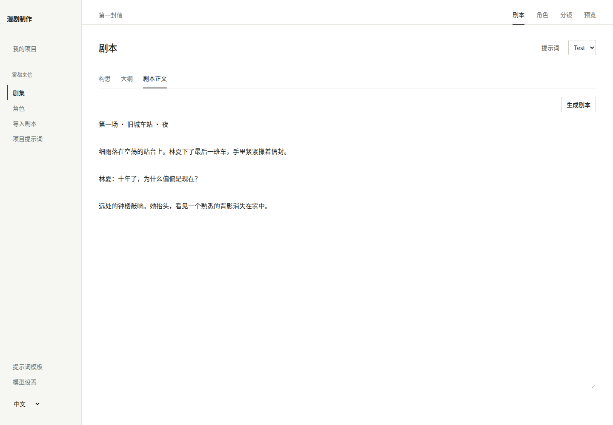
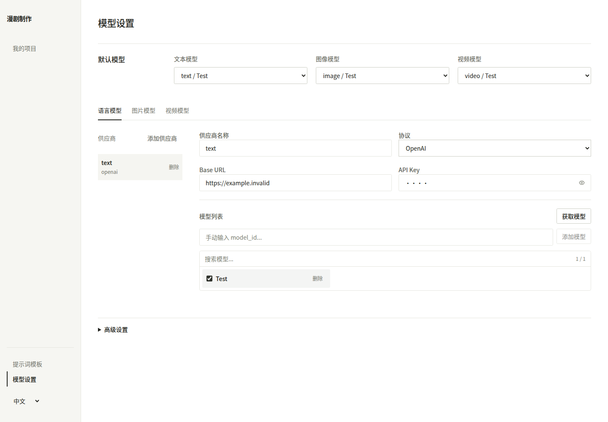
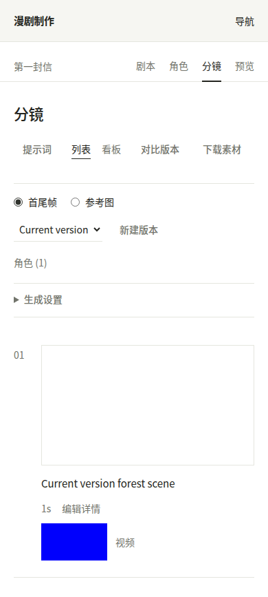
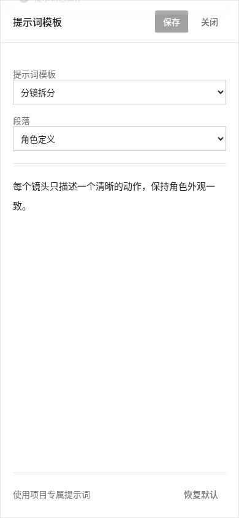

# 界面预览

界面采用浅色背景、深灰文字和细分隔线。桌面左侧放项目及设置导航，剧集内部通过顶部文字链接切换剧本、角色、分镜和预览；手机将左侧导航收起到“导航”按钮中。

页面按实际编辑内容组织：

- 剧本分为构思、大纲和正文三个标签页，一次编辑一份文稿，修改自动保存。
- 角色以连续资料行展示，文字在左、参考图在右；手机按顺序排列。
- 分镜以镜头顺序排列，显示画面、描述、时长和视频。生成设置按需展开，详细编辑在侧栏完成。
- 模型设置使用供应商列表和配置表单，模型、协议、智能体及分镜版本使用普通选择框。
- 提示词编辑直接呈现正文，通过选择框切换模板和段落；保存、关闭和恢复默认保持可见。

界面移除了装饰性的标志、魔杖和机器人图标、步骤圆点以及彩色状态标签。状态信息和常用操作使用文字，播放、关闭等操作保留必要的图标。没有增加 UI 依赖。

以下截图使用浏览器测试中的虚构项目、测试图片和视频，不含真实模型密钥。

## 剧本编辑

## 模型设置

## 手机分镜页面

## 手机提示词编辑

布局检查覆盖 11 个页面的 1440、768、390、360 像素宽度，以及中文、英文、日文和韩文导航。浏览器测试检查标签页编辑与自动保存、模型配置和智能体选择、提示词保存、分镜版本切换、素材上传历史和导入流程。测试入口为 `e2e/workspace.spec.ts`、`e2e/editor.spec.ts` 和 `e2e/import.spec.ts`。
