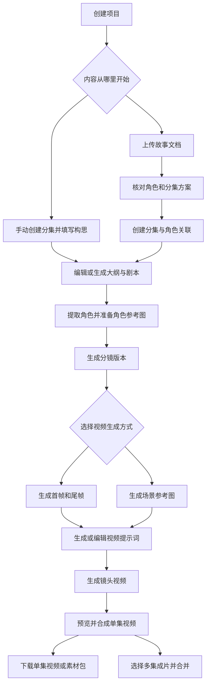

# AI Comic Builder 现有功能模块说明

本文说明当前项目已经实现的功能、页面入口、操作流程、数据产出和使用限制，供使用者和后续开发者查阅。

- 整理日期：2026-09-29。
- 核对范围：当前仓库的页面、组件、API、生成服务与数据库结构；代码基准为 `ced151d`。
- 文中的“页面可用”表示有页面入口和对应实现；“仅后端”表示存在接口但没有接入当前页面；“预留”表示只有数据结构或辅助代码，尚未形成完整功能。
- 分镜版本、图片历史和视频历史是创作内容的版本管理，与软件旧版本兼容无关。

## 目录

1. [项目用途与模块总览](#项目用途与模块总览)
2. [完整创作流程](#完整创作流程)
3. [项目与分集管理](#项目与分集管理)
4. [文档导入与自动分集](#文档导入与自动分集)
5. [剧本创作与编辑](#剧本创作与编辑)
6. [角色与角色关系](#角色与角色关系)
7. [分镜生成与编辑](#分镜生成与编辑)
8. [图片提示词与图片素材](#图片提示词与图片素材)
9. [视频提示词与视频生成](#视频提示词与视频生成)
10. [批量生成与失败重试](#批量生成与失败重试)
11. [预览合成与导出](#预览合成与导出)
12. [模型与供应商配置](#模型与供应商配置)
13. [外部智能体](#外部智能体)
14. [提示词模板与预设](#提示词模板与预设)
15. [界面语言与编辑辅助](#界面语言与编辑辅助)
16. [数据存储与运行方式](#数据存储与运行方式)
17. [仅后端提供或尚未接入的能力](#仅后端提供或尚未接入的能力)
18. [页面与接口索引](#页面与接口索引)
19. [代码与验证入口](#代码与验证入口)

## 项目用途与模块总览

AI Comic Builder 是一个面向漫剧、动画短片创作的网页工作台。用户可以从故事构思或已有文档开始，逐步完成剧本、角色设定、分镜、图片、视频片段和成片。文本、图片、视频由配置的外部模型服务生成；项目本身负责组织内容、编辑、保存、调用模型和使用 FFmpeg 合成视频。

当前主要操作以“项目 → 分集 → 分镜版本 → 镜头”为组织层级。角色保存在项目中，通过关联记录分配到具体分集。

| 功能模块   | 主要用途                                       | 当前入口与状态                                                           |
| ---------- | ---------------------------------------------- | ------------------------------------------------------------------------ |
| 项目与分集 | 建立作品、管理各集的标题与内容                 | 首页、项目分集页，页面可用                                               |
| 文档导入   | 从文件提取文本、角色，生成分集方案             | 项目“导入剧本”，页面可用                                                 |
| 剧本编辑   | 编辑构思、大纲和剧本，调用 AI 辅助创作         | 分集“剧本”，页面可用                                                     |
| 角色管理   | 提取角色、编辑描述、生成或上传参考图、管理关系 | 项目角色页、分集角色页，页面可用                                         |
| 分镜工作台 | 拆分镜头、编辑内容、切换和比较创作版本         | 分集“分镜”，页面可用                                                     |
| 图片生成   | 生成首尾帧或场景参考图，管理素材历史           | 分镜生成设置、镜头详情，页面可用                                         |
| 视频生成   | 生成视频提示词，并调用视频模型生成镜头片段     | 分镜生成设置、镜头详情，页面可用                                         |
| 批量操作   | 批量补充素材、重新生成、重试失败镜头           | 分镜工作台，页面可用                                                     |
| 预览与导出 | 播放片段、合成字幕与转场、下载视频和素材包     | 分集预览页、分镜页、分集列表，页面可用                                   |
| 模型配置   | 配置文本、图片、视频供应商及默认模型           | 全局设置，页面可用                                                       |
| 外部智能体 | 将部分文本生成步骤交给百炼或 Coze 工作流       | 全局设置及生成步骤，页面可用；Dify 仅后端支持                            |
| 提示词管理 | 编辑全局或项目提示词、保存和应用个人预设       | 提示词设置页、项目提示词页、编辑抽屉，页面可用，部分模板尚未接入生成流程 |
| 通用支持   | 四种界面语言、自动保存、本地数据与文件管理     | 贯穿工作台                                                               |

## 完整创作流程

以“制作三集悬疑短片”为例，可以先导入故事文档，也可以手动创建三集。两种方式最终都会进入逐集创作流程。



这个流程有几个明确的边界：

- 导入流程创建的是分集构思、角色资料和关系，不会直接生成完整剧本、图片或成片。
- 手动填写剧本后，可以继续提取角色和生成分镜，不必先使用 AI 生成大纲。
- 分镜页的“一键生成”负责分镜及其图片、视频步骤，不包含文档导入、剧本创作、角色提取、角色参考图生成或最终视频合成。
- 修改上游内容后，已有图片、视频和成片不会自动全部重做，需要按实际需要重新生成。

## 项目与分集管理

### 项目管理

入口是首页项目列表。当前可以：

- 输入名称创建项目，创建后进入该项目的分集列表。
- 查看已有项目的名称、状态和创建时间。
- 打开项目，继续编辑分集、角色或项目提示词。
- 确认后删除项目。

项目创建本身不会自动创建第一集。需要在分集页手动新建，或者通过文档导入创建分集。

项目数据中还保留了世界观、目标时长、色彩方案等字段。其中只有部分字段被生成服务使用，当前没有统一的页面编辑入口，具体见“仅后端提供或尚未接入的能力”。项目改名也有更新接口，但首页没有独立的改名操作。

### 分集管理

每集单独保存标题、简介、关键词、构思、大纲、剧本、生成模式、状态和最终视频地址。

| 操作         | 实际行为                                                       |
| ------------ | -------------------------------------------------------------- |
| 新建分集     | 输入标题，可选填简介和关键词；序号追加到现有分集之后           |
| 编辑分集资料 | 修改标题、简介和关键词                                         |
| 进入创作     | 打开该集的剧本、角色、分镜和预览页面                           |
| 查看缩略图   | 优先展示成片或已有镜头图片；没有镜头图片时可使用关联角色参考图 |
| 删除分集     | 删除对应分集及有外键关联的内容；系统拒绝删除项目中最后一集     |
| 播放成片     | 已有最终视频的分集可直接在列表中打开播放器                     |
| 合并多集     | 选择至少两集已有成片，按分集序号合并视频                       |

分集重排已有后端接口和状态层方法，当前列表没有拖动排序或上下移动按钮。

## 文档导入与自动分集

入口是项目分集页的“导入剧本”。适用于已有小说、故事梗概或剧本文档的情况。

### 文件输入

- 支持 `.txt`、`.docx`、`.pdf`、`.md` 和 `.markdown`。
- 支持点击选择和拖放文件；页面限制单个文件不超过 20 MB。
- TXT 和 Markdown 按 UTF-8 文本读取；DOCX 使用 Mammoth 提取正文；PDF 使用 unpdf 提取文字。
- 这是文本提取流程，没有扫描图片 OCR。纯扫描 PDF 需要先转换成可提取文字的文件。
- 页面启动导入前要求配置文本模型。角色提取和自动分集都会调用该模型。

### 四个处理步骤

| 步骤        | 输入                         | 处理内容                                                             | 用户可以核对什么                         |
| ----------- | ---------------------------- | -------------------------------------------------------------------- | ---------------------------------------- |
| 1. 解析文件 | 上传的文件                   | 提取全文，记录字数和解析结果                                         | 文件是否解析成功                         |
| 2. 提取角色 | 提取的文本                   | 提取角色名称、出场频次、描述、视觉特征和角色关系；按名称合并重复角色 | 查看角色资料，并切换主角或配角分类       |
| 3. 自动分集 | 全文和确认后的角色列表       | 生成分集标题、简介、关键词、构思文本和出场角色                       | 修改标题、移除不需要的分集，展开查看构思 |
| 4. 创建内容 | 确认后的角色、关系和分集方案 | 保存角色、角色关系、分集及角色与分集的关联                           | 完成后回到分集列表继续创作               |

角色初始分类按提取结果中的出场频次决定：频次至少为 2 的角色先归为主角，其他归为配角；用户可以在确认前调整。这个分类是初始建议，不等于对故事重要性的准确判断。

长文本按段落分块处理，目标块大小约为 10,000 字符，角色提取和分集步骤会限制并发。块大小不是严格的模型上下文保证，单个过长段落仍可能超过该目标。

### 日志、重试和数据保存

- 页面展示当前步骤、运行中、完成或失败状态及日志。
- 服务器保存导入日志，再次进入可以查看上次记录。
- 当前页面中的失败步骤可以重试；后续步骤重试继续使用页面里已确认的数据。
- 重新进入页面恢复的是历史日志，不是可继续执行的完整导入会话；原始文件、全文和未提交的手工修改没有完整的跨刷新恢复机制。
- 完成导入会在已有分集后追加内容，不会清空原有项目。重新执行一次完整导入可能产生重复角色和分集。
- 最后一步使用数据库事务保存角色、关系与分集，避免只创建其中一部分。

导入的分集内容写入“构思”，大纲和剧本仍需要在剧本页补充。

## 剧本创作与编辑

入口是分集内的“剧本”页面。编辑器提供三个区域：

| 区域     | 用途                                   | 操作                                         |
| -------- | -------------------------------------- | -------------------------------------------- |
| 构思     | 描述故事目标、情节素材或导入的分集原文 | 手动输入、修改                               |
| 大纲     | 组织故事结构和场景安排                 | 手动编辑，或根据构思生成                     |
| 剧本正文 | 后续角色提取、分镜生成使用的主要文本   | 手动编写、粘贴完整剧本，或根据构思和大纲生成 |

AI 生成剧本时，如果大纲为空，会先生成大纲，再继续生成剧本。页面中的 AI 生成按钮要求有构思内容；单纯手动编辑正文不需要模型配置。

大纲和剧本采用流式显示，生成过程中可以看到文字逐步出现。生成结果完整返回后才覆盖服务器中对应的已保存文本；中断的流不会作为完整剧本保存。

编辑器在停止输入约 1.5 秒后自动保存，并在失焦或发起生成前提交待保存内容。页面显示保存和生成状态，保存失败会提示错误。

在页面上还可以选择文本模型、绑定对应类别的外部智能体，以及打开大纲和剧本提示词编辑抽屉。

修改剧本后，更新接口会标记相关下游记录为需要重新检查，分镜列表可以显示过期提示。这是提醒机制，不会自动修正镜头、图片、对白或视频；也不代表所有角色关联和生成路径都有完整的依赖追踪。

## 角色与角色关系

### 项目角色和分集角色

角色在项目中统一保存，分集通过关联记录引用角色。同一角色可以出现在多集里，名字、描述和参考图由多集共享。

- 项目角色页查看整个项目的角色，区分主角和配角；有归属集的配角会按集展示。
- 分集角色页查看该集实际关联的角色，并提供“解析角色”操作。
- 重新解析角色时，会按规范化后的名称匹配项目已有角色，更新匹配角色的描述等信息，并重建当前集的角色关联。
- 将配角提升为主角会修改该角色的分类；主角身份本身不会自动把它加入所有分集。
- 项目角色页可以删除角色；这会影响其他引用该角色的分集，操作前有确认。

当前没有独立的“手动新建角色”表单。角色主要通过文档导入或从剧本解析得到。

### 角色资料编辑

页面可直接编辑以下字段，并在失焦时保存：

| 字段     | 作用                           | 例子                                     |
| -------- | ------------------------------ | ---------------------------------------- |
| 名称     | 在剧本、关系和镜头中识别角色   | 林舟                                     |
| 描述     | 说明外观、服装、风格等生成依据 | 短黑发、灰色风衣、青年侦探，二维动画风格 |
| 视觉特征 | 用简短特征帮助生成过程区分人物 | 黑发、灰色风衣                           |

解析结果还可以保存身高、体型、表演风格等信息，但当前角色卡片没有这些字段的独立编辑控件。

### 角色参考图

每个角色可以：

- 使用图片模型生成一张包含正面、四分之三角度、侧面和背面的四视图。
- 手动上传参考图片，作为后续生成使用的当前形象。
- 查看大图、复制四视图生成提示词。
- 在多次生成或上传形成的历史图片之间切换，重新选择当前参考图。
- 在单个角色生成时临时选择图片模型；未指定时使用默认图片模型。

分集角色页提供批量生成，默认只处理还没有参考图的角色。分镜页还有角色参考图的展开区域，便于查看本集角色和补充缺失图片。

角色四视图的画风主要由描述和提示词约束。当前没有独立的风格识别模型或统一画风选择器；写明画风的描述会被传给生成模型，但不能保证不同模型的视觉一致性。

### 角色关系

当页面有至少两个角色时，可以维护关系：选择两个角色、关系类型和说明，添加后查看或删除。现有类型包括同盟、敌对、恋人、家人、师徒、竞争者、陌生人与中立。

AI 角色解析和文档导入也可以生成关系。分镜及图片提示词生成会使用相关人物关系，辅助安排对峙、亲近、站位和互动。

当前展示的是关系列表，没有可拖拽的关系图，也没有关系随剧情变化的时间线。重新解析角色可能更新共享资料和替换相关关系，因此应核对之前的手工修改。

## 分镜生成与编辑

### 生成分镜

入口是分集“分镜”页的生成设置，前提是该集已有非空剧本，并配置文本模型或分镜智能体。

生成服务会读取剧本、该集角色和角色关系，拆解出按序排列的镜头。每个镜头可包含：

- 场景描述和出场人物信息。
- 分段动作脚本、简要视频描述、运镜方式和时长。
- 与角色对应的对白。
- 入场、出场转场类型。
- 构图指引、焦点、景深、声音设计和音乐提示。

这些结果不是一次就直接生成的视频。图片提示词、图片和视频仍由后续步骤分别生成。

### 分镜版本

每次重新拆分剧本会创建一个新的分镜版本，保留原有版本及其镜头素材。版本有递增序号和日期标签。

- 可以切换版本，继续编辑某一次生成结果。
- 有至少两个版本时，可以并排比较两个版本的镜头描述和首帧。
- 比较按镜头位置排列，不进行语义匹配或逐字差异标记；目前比较图使用首帧，不是参考图或视频比较。
- 预览和素材下载会携带当前选择的版本。未指定版本的相关读取流程通常选择最新版本。

不同版本保存的是镜头及素材，不是整集剧本和角色库的完整快照。角色资料仍共享，分集最终视频也只有一个当前地址。

### 查看和编辑镜头

| 视图或操作   | 功能                                                         |
| ------------ | ------------------------------------------------------------ |
| 列表视图     | 按顺序查看镜头描述、缩略图、时长、视频状态                   |
| 看板视图     | 按待生成图片、待生成提示词、待生成视频、已完成四类查看进展   |
| 镜头详情抽屉 | 在当前工作台打开完整镜头编辑区                               |
| 文本编辑     | 修改场景描述、动作脚本、运镜和视频提示词，自动保存           |
| AI 优化      | 输入修改要求，优化某个文本字段；图片提示词优化可附带当前图片 |
| 重写镜头     | 一次重写镜头描述、首尾帧描述、动作脚本等文本                 |
| 素材操作     | 预览图片或视频、替换图片、生成素材、切换历史                 |
| 时长与转场   | 调整镜头时长和入场、出场转场                                 |

当前时长输入框范围是 5–15 秒。实际发送给视频模型的时长还会受模型上限和供应商适配规则影响，不能把输入框范围当作所有模型的能力。

对白在详情中展示，构图、焦点、景深、声音和音乐说明也会展示，但没有完整的对白编辑器、声音编辑器或音乐轨道。这些文本字段不会自动生成音效文件。

看板分类依赖当前已有素材，不是人工拖动的任务状态。当前没有镜头拖动排序、自由时间线剪辑、手动新增或删除镜头的完整页面操作。镜头删除和字段修改已有后端接口，但没有手动新增镜头的接口。

## 图片提示词与图片素材

### 两种生成模式

每个分集可以在分镜页切换“首尾帧模式”和“参考图模式”。同一镜头的两类图片、两类视频分开保存，切换模式不会直接删除另一模式的素材。

两种模式仍共用镜头上的视频提示词字段。切换模式后应重新核对或生成提示词，不能把两套图片、视频历史理解为两套完全独立的镜头文本。

| 对比项       | 首尾帧模式                               | 参考图模式                       |
| ------------ | ---------------------------------------- | -------------------------------- |
| 图片内容     | 一个镜头的首帧和尾帧                     | 一个或多个纯场景参考图           |
| 人物形象来源 | 生成图片时可使用角色参考图               | 视频生成时组合角色参考图与场景图 |
| 图片生成顺序 | 先首帧，再将首帧和角色参考图作为尾帧参考 | 按场景参考图的提示词生成各张图片 |
| 生成视频前提 | 首帧和尾帧都存在                         | 当前启用的所有场景参考图都有文件 |
| 适用意图     | 明确约束一段动作的起点和终点             | 让模型结合人物、场景参考组织动作 |

### 生成图片提示词

文本模型或对应智能体根据镜头内容、人物特征、人物关系以及剧本中的视觉风格说明生成图片提示词。

- 首尾帧模式为每个镜头生成两段描述，分别存到首帧和尾帧素材记录。
- 参考图模式生成场景名称、场景描述及该镜头涉及的人物。场景图按纯环境设计，人物参考留给视频阶段。
- 用户可以直接编辑提示词，或者通过“AI 优化”输入修改要求。
- 图片上的角色选择用于维护参与该镜头的人物名称，供后续参考图组合使用。

重新批量生成图片提示词会为目标镜头创建新的待生成素材记录，并切换当前使用的记录。它不只是补充一个空字段，可能让已有图片暂时不再作为当前素材，旧素材记录仍保留。

### 生成、上传和历史

- 可以对当前版本批量生成图片，也可以在单个镜头里生成。
- 首尾帧按一对生成；参考图可按镜头生成全部，也可只重新生成其中一张。
- 参考图模式下，页面最多允许手动添加 9 个场景参考图条目；外部模型实际可接收的参考图总数还要考虑人物参考图和模型限制。
- 参考图条目可以指定图片模型供该条目的单独生成操作使用；批量生成使用工作台选定的默认图片模型。
- 支持上传 PNG、JPEG、WebP 替换首帧、尾帧或场景参考图。
- 支持清除当前图片条目、预览大图，以及在同一位置的历史图片之间切换。
- 清除条目会停用当前记录，不等于删除服务器上的物理文件；不要将其当作磁盘清理功能。

图片与视频素材统一保存在素材表中，以镜头、类型、位置和版本区分，当前采用的记录与历史记录分别标记。直接修改提示词是修改当前记录的元数据，不是对每次文字修改都创建历史版本。

## 视频提示词与视频生成

### 视频提示词

视频提示词负责描述动作变化、运镜、时长和必要的对白约束。当前既支持 AI 生成，也支持直接手工修改。

使用普通文本模型生成时，会读取已有帧图或场景图，并结合动作脚本、角色特征和对白生成文本。因此，这一步需要支持图片输入的文本模型；仅支持纯文本的模型不一定能完成。

参考图模式会组织人物参考与场景参考的对应关系。生成视频时，服务会补充图片序号映射，帮助模型区分人物和场景。

镜头已有手写或生成的视频提示词时，视频生成优先使用它；没有时，后端可根据镜头资料构建提示词。页面的批量视频按钮要求各镜头具备提示词和必要图片，操作条件比底层单镜头接口更严格。

### 视频生成

- 支持逐镜头生成、批量生成和重新生成。
- 首尾帧模式提交首帧、尾帧、提示词、比例和时长。
- 参考图模式提交场景图，并组合该镜头涉及角色的参考图；纯环境镜头可以没有角色参考图。
- 生成结果下载到本地素材目录，并记录为当前镜头的视频素材。
- 同一镜头分别保留首尾帧视频和参考图视频的历史，可以切换当前采用的结果。

视频比例选项为 `16:9`、`9:16`、`1:1` 和 `adaptive`。画幅选项会传给生成流程，但不同供应商的处理不同；当前图片侧对未明确匹配的比例，包括 `adaptive`，按 `16:9` 构建请求，因此不能承诺“自适应”使图片和视频自动保持一致。

系统按内置模型时长规则限制请求，具体供应商还可能转换时长或拒绝不支持的组合。接入某个协议，并不表示该协议下所有模型都支持首尾帧、多参考图、音频和所有画幅。

当前没有独立的配音生成、声音克隆或口型同步编辑模块。视频模型本身返回的音轨可以随视频保存和合成；提示词中的对白要求不等于项目已经实现了独立配音系统。

## 批量生成与失败重试

分镜工作台将主要生成工作划分为：分镜、图片提示词与图片、视频提示词、视频四个阶段。

| 操作               | 默认行为                                               |
| ------------------ | ------------------------------------------------------ |
| 批量生成角色参考图 | 只处理没有参考图的角色                                 |
| 批量生成首尾帧     | 已有完整首尾帧的镜头会跳过                             |
| 批量生成场景参考图 | 处理有提示词且缺文件、待生成的条目                     |
| 批量生成视频提示词 | 已有提示词默认跳过                                     |
| 批量生成视频       | 已有当前模式视频的镜头默认跳过                         |
| 重新生成图片或视频 | 对目标范围重新调用模型，成功后切换当前素材并保留旧版本 |
| 重试失败镜头       | 对上一次批量结果中失败的镜头发起单镜头请求             |

“一键生成”按当前模式顺序执行：必要时生成分镜 → 必要时生成图片提示词 → 图片 → 视频提示词 → 视频。中间阶段失败会停止继续执行，已完成结果保留。它可以补充缺失内容，但不是严格的逐条增量生成：例如需要图片提示词时，调用的是当前版本的批量提示词生成。

批量生成通常限制为同时处理 3 个镜头，单次返回中区分成功、跳过和失败。页面展示运行状态及失败信息；普通批量请求不是持续推送逐镜头进度，重试时会更新已完成数量。

当前执行过程依赖网页请求和服务进程，没有独立的持久化任务队列、跨重启恢复或可靠的关闭页面后续跑机制。已有素材能保存，不代表未完成任务能自动恢复。

## 预览合成与导出

### 镜头预览

入口是分集“预览”页面。

- 播放当前分镜版本中已经生成的视频片段。
- 从列表选择镜头，或使用前后切换操作。
- 切换观看镜头片段和当前单集成片。
- 两种模式都有视频时，可以选择预览首尾帧视频或参考图视频。

分镜页跳转到预览页时会保留选中的分镜版本。预览模式也会作为合成参数传给后端。

### 单集合成

点击合成后，服务器使用 FFmpeg：

1. 读取所选分集、分镜版本和视频模式下已有的视频素材。
2. 按镜头序号排列，缺少视频的镜头会被略过。
3. 探测实际视频时长和音轨，统一必要的视频、音频参数。
4. 拼接镜头并应用转场。
5. 根据数据库中的对白生成 SRT，尝试把字幕烧录到视频。
6. 保存最终 MP4，并将其设为该集的当前成片。

当前至少有一个视频片段就能合成，不要求全部镜头完成。需要完整成片时，应先核对缺失镜头。

已有音轨在合成时会被保留；混合有声、无声片段时，会给无声段补静音以保持时间对应。有重叠转场时，视频和音频按相同的重叠时长处理。全部输入都无音轨时，合成不会凭空生成对白或音乐。

支持的转场包括直接切换、叠化、淡入、淡出、向左擦除、向右滑动和圆形展开。连接两个镜头时，优先采用前一镜头的出场转场；前一镜头使用直接切换时，再参考后一镜头的入场转场。当前“淡入、淡出”在拼接中都映射为镜头间淡化，不是独立的片头淡入和片尾淡出。

### 字幕

- 字幕内容来自已保存的镜头对白，格式包含角色名和台词。
- 分镜生成只保存能匹配到已有角色的对白；未先准备角色资料，可能影响最终字幕内容。
- 时间根据实际片段时长、对白时间比例及转场重叠计算；没有时间比例时，底层可按对白数量平均分配。
- 当前生成的对白默认时间比例为 0–1，未按真实语音逐句对齐，同一镜头内的多句对白可能重叠。
- 当前对白没有独立的字幕时间轴编辑页面，也没有语音识别或强制对齐。
- SRT 会保留在服务器输出目录；当前页面没有单独的 SRT 下载按钮，素材 ZIP 也不会自动包含它。
- 字幕烧录失败时，合成实现会保留未烧录字幕的视频，因此“合成成功”不一定意味着字幕已成功显示。

### 多集合并

在项目分集列表选择至少两集已生成成片的内容，可以合并成一个视频。排序依据分集序号，不依据鼠标勾选的先后顺序。

这一步拼接各集已有成片，不重新生成镜头，也不重新提取对白。合并结果可在当前页面预览和下载；当前没有单独的合并成片库或合并结果历史列表。

### 下载内容

| 下载方式       | 实际包含内容                                                                                 | 不包含或需要注意的内容                               |
| -------------- | -------------------------------------------------------------------------------------------- | ---------------------------------------------------- |
| 分集预览页下载 | 该集当前最终 MP4                                                                             | 不是所有分镜版本的成片集合                           |
| 分镜页素材 ZIP | 当前集关联角色的当前参考图、所选分镜版本的当前图片和两种模式的视频素材、该集当前成片（如有） | 不含全部历史素材、数据库、提示词配置、剧本文本或 SRT |
| 多集合并下载   | 此次合并得到的 MP4                                                                           | 不会替换每一集各自的成片                             |

素材包中的文件按 `characters/`、`shot-01/` 等目录组织，缺失或找不到本地文件的素材不会打入压缩包。

单集最终视频只有一个当前地址，没有按分镜版本或生成模式分别记录。切换版本后，旧成片仍可能显示；素材 ZIP 中的 `final-video` 也可能来自之前合成的版本。要让成片与所选镜头一致，需要重新合成。

## 模型与供应商配置

入口是全局“设置”。配置按文本、图片、视频三种用途分开。

### 可配置的协议

| 用途 | 页面提供的协议                                                      | 在项目中的用途                               |
| ---- | ------------------------------------------------------------------- | -------------------------------------------- |
| 文本 | OpenAI、Gemini                                                      | 大纲、剧本、角色、分镜、提示词生成和文本优化 |
| 图片 | OpenAI、Gemini、Kling、百炼图片（DashScope）                        | 角色四视图、首尾帧、场景参考图               |
| 视频 | Seedance、Seedance（UCloud）、Gemini（Veo）、Kling、百炼视频（Wan） | 镜头视频生成                                 |

这里描述的是仓库已有的协议适配和配置入口，不是对供应商当前所有模型的可用性承诺。实际调用还取决于模型 ID、接口地址、账户权限、额度和该模型支持的输入方式。

### 供应商与模型管理

当前可以：

- 为每种用途添加多个供应商，编辑名称、协议、Base URL 和密钥。
- Kling 分别配置 Access Key 和 Secret Key；其他常规入口使用 API Key。
- 显示或隐藏密钥输入内容。
- 获取模型列表，或手动输入模型 ID。
- 搜索模型、勾选要出现在选择器中的模型、删除模型。
- 分别选择默认文本模型、默认图片模型和默认视频模型。
- 在剧本、角色和分镜生成步骤中使用模型选择器切换模型。

“获取模型列表”有两种实现：OpenAI、Gemini 等路径会访问接口；Kling、UCloud Seedance、Wan 和百炼图片返回代码中维护的模型列表。看到列表不等于已经验证账户可以调用所有条目。

配置保存在当前浏览器的本地存储中，包括供应商密钥和默认模型选择；生成时随请求发送给服务器。大部分工作台模型选择器修改的是浏览器全局默认值，不是项目独立配置。角色单次生成和场景参考图单项生成存在局部模型选择，作用范围见对应模块。

换浏览器、清除站点存储或换访问域名后，需要重新检查模型配置。当前没有模型配置的服务器同步、费用统计或额度管理页面。

## 外部智能体

外部智能体用于替代指定步骤的普通文本模型调用，不负责直接生成所有图片或视频。

设置页可以新增、编辑、删除智能体，保存名称、平台、类别、应用或工作流 ID、API Key 和说明。当前界面提供百炼和 Coze 平台选项；后端还实现了 Dify 调用，但 Dify 选项没有在设置表单开放。

| 智能体类别          | 对应操作             | 页面接入情况                         |
| ------------------- | -------------------- | ------------------------------------ |
| `script_outline`    | 生成大纲             | 剧本页                               |
| `script_generate`   | 生成剧本             | 剧本页                               |
| `script_parse`      | 结构化解析剧本       | 可配置类别，但当前剧本页没有触发入口 |
| `character_extract` | 从当前剧本提取角色   | 分集角色页                           |
| `shot_split`        | 拆分镜头             | 分镜生成设置                         |
| `keyframe_prompts`  | 首尾帧提示词         | 首尾帧模式生成设置                   |
| `ref_image_prompts` | 场景参考图提示词     | 参考图模式生成设置                   |
| `video_prompts`     | 首尾帧模式视频提示词 | 对应分镜生成设置                     |
| `ref_video_prompts` | 参考图模式视频提示词 | 对应分镜生成设置                     |

智能体按“项目 + 类别”绑定。页面只在存在匹配类别的智能体时显示选择器；选中后，该项目的对应步骤使用该智能体，未绑定时使用普通文本模型。

- 智能体必须返回该步骤要求的文本或结构化结果，项目会解析并验证关键结果。
- 调用失败会返回错误，不会自动保证切回其他模型完成。
- 文档导入中的角色提取、自动分集，以及通用文本优化，并没有统一改走这些项目绑定。
- 智能体定义和绑定保存在服务器数据库中，与浏览器本地保存的普通模型配置不同。

仓库 [agents](../agents) 目录提供百炼、Coze、Dify 的工作流资料。这些文件用于外部平台配置，不会因为放在仓库里就自动部署为可运行的工作流。

## 提示词模板与预设

### 三个使用入口

- 全局提示词页：编辑当前用户跨项目使用的提示词配置。
- 项目提示词页：查看当前项目哪些模板有覆盖，并编辑或恢复全局设置。
- 创作页提示词抽屉：在剧本、角色、分镜页面就地编辑相关模板，不必离开当前工作。

提示词按剧本、角色、分镜、图片和视频分组。当前注册表共有 16 个模板。

### 已注册模板及实际使用情况

| 模板键                       | 用途                     | 当前生成流程是否读取                                         |
| ---------------------------- | ------------------------ | ------------------------------------------------------------ |
| `script_outline`             | 大纲生成                 | 是                                                           |
| `script_generate`            | 剧本生成                 | 是                                                           |
| `script_parse`               | 剧本结构化解析           | 仅后端解析动作读取，页面没有触发操作                         |
| `script_split`               | 文档自动分集             | 是                                                           |
| `character_extract`          | 分集剧本角色提取         | 是                                                           |
| `import_character_extract`   | 导入全文角色提取         | 是                                                           |
| `character_image`            | 角色图片生成模板         | 当前角色四视图使用独立提示词构造函数，没有读取这里的用户覆盖 |
| `shot_split`                 | 剧本拆分镜头             | 是                                                           |
| `shot_split_keyframe_assets` | 镜头首尾帧描述           | 是                                                           |
| `frame_generate_first`       | 首帧图片生成             | 读取分段内容                                                 |
| `frame_generate_last`        | 尾帧图片生成             | 读取分段内容                                                 |
| `scene_frame_generate`       | 场景参考帧生成模板       | 当前参考图直接使用素材提示词，此模板未接入该生成路径         |
| `ref_image_prompts`          | 多场景参考图提示词       | 是                                                           |
| `video_generate`             | 首尾帧视频相关提示词     | 读取分段内容，已有镜头视频提示词时优先使用后者               |
| `ref_video_generate`         | 参考图视频相关提示词     | 读取分段内容，已有镜头视频提示词时优先使用后者               |
| `ref_video_prompt`           | 根据参考图生成视频提示词 | 普通文本模型路径读取；绑定智能体时使用智能体路径             |

### 分段编辑与完整提示词编辑

普通模式把提示词分成若干内容段，允许修改标记为可编辑的部分。用于输出结构等关键内容的段落可以设为只读。页面显示修改状态，支持保存、恢复和查看组合后的完整提示词。

高级模式可以编辑完整提示词，保存前检查关键结构；存在结构警告时，页面允许用户查看警告并决定是否继续保存。

实际覆盖规则需要区分两条路径：

1. **按分段构建的提示词**：同一段按项目覆盖 → 用户全局覆盖 → 代码默认内容选择。
2. **读取完整提示词的路径**：先检查项目完整覆盖，其次全局完整覆盖；没有完整覆盖时，才按分段规则组合。

因此，全局完整覆盖可能让项目分段修改不再进入最终内容。图片、视频部分动态构造流程只读取分段内容，高级模式的完整覆盖不会自动作用于所有生成操作。

项目提示词管理页关闭项目设置时，会删除该页维护的项目覆盖；单个模板也可以选择“使用全局”。保存项目分段内容或抽屉内容会自动开启项目设置。当前解析器按已保存的覆盖记录解析，没有统一用 `useProjectPrompts` 字段阻止读取，所以仅修改这个开关字段不等于清除覆盖。

修改模板影响的是后续生成；已经保存到镜头上的提示词、图片和视频不会随之自动更新。

### 个人预设与历史

可以把某个模板的当前分段内容保存成命名预设，之后应用或删除。当前代码中的内置预设列表为空，没有随项目提供可直接使用的内置风格预设。

当前预设弹窗的“应用”操作固定写入全局配置，即使从项目提示词编辑页打开也一样。后端虽然有项目作用域参数，页面尚未传递这个范围，不能把弹窗应用理解为只修改当前项目。

提示词更新会保存历史内容，后端支持查询和恢复历史版本；当前页面没有完整的历史版本浏览与恢复入口。“恢复默认”是删除覆盖，不等于选择某一条历史记录。

## 界面语言与编辑辅助

界面提供中文、英语、日语和韩语，路径前缀分别是 `zh`、`en`、`ja`、`ko`。语言切换保留当前页面路径和查询参数。

界面语言不等于内容自动翻译。切换语言不会重写已有剧本、角色或视频；部分运行日志和模型返回错误仍可能是中文或英文。

其他通用操作包括：

- 桌面项目导航和移动端可展开导航。
- 剧本、角色、分镜、预览之间切换。
- 图片放大、视频弹窗播放和镜头详情抽屉。
- 剧本和镜头文本自动保存；生成、切换分镜版本前提交待保存内容。
- 保存失败、模型未配置、生成失败的提示。
- 按项目记住列表或看板的查看方式。

自动保存主要用于文本和元数据。提示词模板编辑仍有显式保存操作，外部模型请求也不属于浏览器离线任务。

## 数据存储与运行方式

### 数据放在哪里

| 内容                               | 存储位置          | 说明                                               |
| ---------------------------------- | ----------------- | -------------------------------------------------- |
| 项目、分集、角色、分镜、素材元数据 | SQLite            | 默认 `data/aicomic.db`，可通过 `DATABASE_URL` 调整 |
| 图片、镜头视频、成片、字幕         | 本地素材目录      | 默认 `uploads/`，可通过 `UPLOAD_DIR` 调整          |
| 提示词覆盖、预设、历史、导入日志   | SQLite            | 按用户或项目保存                                   |
| 外部智能体及项目绑定               | SQLite            | 包括连接外部工作流的配置                           |
| 普通模型供应商、密钥、默认模型     | 浏览器本地存储    | 不属于数据库备份内容                               |
| 浏览器用户标识                     | Cookie 与本地存储 | 使用 `ai_comic_uid` 关联当前浏览器的数据           |
| 列表或看板偏好                     | 浏览器本地存储    | 按项目保存                                         |

主要数据关系如下：

```text
项目
├── 分集
│   ├── 构思、大纲、剧本
│   ├── 分镜版本
│   │   └── 镜头
│   │       ├── 场景描述、动作、运镜、时长、转场
│   │       ├── 对白 → 角色
│   │       └── 素材历史
│   │           ├── 首帧、尾帧、场景参考图
│   │           └── 首尾帧视频、参考图视频
│   └── 当前成片地址
├── 角色 ← 分集与角色关联记录
├── 角色关系
├── 项目提示词覆盖
├── 智能体绑定
└── 导入日志
```

项目没有注册登录、密码、团队成员或角色权限管理。当前依据浏览器标识区分项目和配置，不能按完整账号系统理解。更换浏览器、访问域名或清理身份 Cookie，可能使原数据不再出现在当前列表中。

数据库保存的是素材路径和内容信息，图片、视频文件另存。备份作品需要同时保留数据库和素材目录；浏览器模型配置需要另外保留。素材 ZIP 是导出创作素材，不是可恢复整个应用的项目备份。

删除数据库记录或停用素材，不代表自动删除对应磁盘文件。当前没有统一的废弃素材清理、回收站或文件备份管理页面。

### 运行依赖

项目是一个 Next.js 应用，页面与 API 在同一应用中运行，不需要分别启动两个服务。

- Node.js 使用仓库 `.nvmrc` 指定的 `24.15.0`。
- 包管理器由 `package.json` 固定为 `pnpm@10.11.0`。
- 启动时自动执行 Drizzle 数据库迁移。
- 视频探测、拼接、转场和字幕依赖服务器安装的 FFmpeg / ffprobe。
- AI 生成依赖配置的外部模型服务；应用没有内置可离线运行的文本、图片或视频大模型。

本地开发常用命令：

```bash
nvm use
corepack enable
pnpm install
pnpm dev
```

默认前端地址是 <http://localhost:3000/zh>。生产运行使用 `pnpm build` 后执行 `pnpm start`。完整安装与部署说明见 [README](../README.md)。

## 仅后端提供或尚未接入的能力

下列内容确实存在于仓库，但不能按当前页面已经提供的完整模块介绍。

### 有接口或处理逻辑，当前没有页面入口

| 能力                   | 现有实现                                           | 当前边界                                                                                                                     |
| ---------------------- | -------------------------------------------------- | ---------------------------------------------------------------------------------------------------------------------------- |
| 分集排序               | `PUT /api/projects/{id}/episodes/reorder`          | 接受分集 ID 顺序，没有页面排序控件                                                                                           |
| 剧本结构化解析         | 生成动作 `script_parse`                            | 流式返回结构化文本并验证结果；当前剧本页没有按钮，也未保存独立的解析结果对象                                                 |
| 直接上传并分集         | `POST /api/projects/{id}/upload-script`            | 另有上传后直接创建分集的接口和未挂载组件；当前入口使用四步导入流程                                                           |
| 镜头连续性检查         | `POST /api/projects/{id}/continuity-check`         | 用带图片输入的文本模型比较相邻镜头的尾帧和首帧；当前按项目取镜头，没有按当前分集、版本过滤，也没有页面报告                   |
| 情绪强度分析           | `POST /api/projects/{id}/emotion-analysis`         | 根据镜头文字返回紧张度和情绪评分；按项目处理，已有曲线组件未挂载到页面                                                       |
| 风格参考图记录         | `mood-board` 相关接口                              | 可添加、查询和删除记录，记录中包含图片地址、注释和提取风格文本；没有页面参考板，也没有自动从这些图片提取并应用风格的完整流程 |
| 角色服装资料           | 角色 `costumes` 的 GET、POST 接口                  | 可记录服装名称、描述和参考图，没有页面服装管理或按镜头切换的完整流程                                                         |
| 提示词历史恢复         | `prompt-templates/{promptKey}/versions` 及恢复接口 | 有历史保存、查询与恢复，尚无完整页面入口                                                                                     |
| Dify 工作流            | 智能体 API 与调用实现                              | 可通过后端配置，设置页面没有开放 Dify 选项                                                                                   |
| 世界观、目标时长       | 项目及分集更新接口、剧本和分镜生成逻辑             | 世界观会进入剧本和分镜上下文；目标时长会作为分镜规划提示；没有页面配置入口，也不是严格的成片时长控制                         |
| 镜头删除及扩展字段更新 | 单镜头 PATCH / DELETE                              | 可删除镜头或修改序号、构图、声音说明等字段；页面没有对应完整操作，镜头新增依赖分镜生成                                       |

### 只有数据结构或辅助函数，尚未形成完整功能

| 能力                | 代码现状                                             | 当前不能据此认为已经支持什么                                         |
| ------------------- | ---------------------------------------------------- | -------------------------------------------------------------------- |
| 背景音乐混音        | `assembleVideo` 接受 `bgmPath`，项目有 `bgmUrl` 字段 | 当前成片接口没有把项目音乐传入混音函数，没有音乐上传、选曲和音量页面 |
| 片头、片尾卡片      | FFmpeg 工具有文字卡片生成及前后插入参数              | 当前合成入口没有提供配置或传递这些参数                               |
| 对白音频            | 对白表有 `audioUrl` 字段                             | 没有独立 TTS、角色音色管理和对白音频生成流程                         |
| 场景资料与镜头分组  | 存在场景表、镜头 `sceneId`，列表可显示已有分组       | 当前分镜生成没有创建完整的场景资料和分组管理流程                     |
| 全局色彩方案        | 有 `colorPalette` 字段和提示词参数                   | 当前主要调用未把该字段接入统一的颜色控制流程                         |
| 细分动作记录        | 存在 `shot_actions` 表                               | 没有动作轨道编辑与驱动生成的完整流程                                 |
| 提示词 A/B 比较实验 | 存在 `prompt_ab_tests` 表                            | 没有实验创建、生成对照结果、评分和报告页面                           |
| 镜头服装覆盖        | 镜头有 `costumeOverrides` 字段                       | 没有完成服装选择到图片、视频生成的连接                               |

项目当前也没有多人实时协作、完整账号权限、任意时间线剪辑、项目打包导入恢复、模型计费统计和任务队列管理。这些不应从已有字段、组件名称或历史宣传材料中推断为可用功能。

## 页面与接口索引

### 页面地址

`{locale}` 为 `zh`、`en`、`ja`、`ko`，`{id}` 为项目 ID，`{episodeId}` 为分集 ID。

| 页面             | 路径                                                                             |
| ---------------- | -------------------------------------------------------------------------------- |
| 项目首页         | `/{locale}`                                                                      |
| 分集列表         | `/{locale}/project/{id}/episodes`                                                |
| 导入剧本         | `/{locale}/project/{id}/import`                                                  |
| 项目角色         | `/{locale}/project/{id}/characters`                                              |
| 项目提示词       | `/{locale}/project/{id}/prompts`                                                 |
| 分集剧本         | `/{locale}/project/{id}/episodes/{episodeId}/script`                             |
| 分集角色         | `/{locale}/project/{id}/episodes/{episodeId}/characters`                         |
| 分集分镜         | `/{locale}/project/{id}/episodes/{episodeId}/storyboard`                         |
| 分集预览         | `/{locale}/project/{id}/episodes/{episodeId}/preview`，可带 `versionId` 查询参数 |
| 模型与智能体设置 | `/{locale}/settings`                                                             |
| 提示词编辑       | `/{locale}/settings/prompts`，可带 `scope`、`projectId`、`prompt` 查询参数       |

### 主要 API 分组

下表用于定位功能实现，不代替请求参数文档；完整参数以路由代码和生成请求定义为准。

| 接口组     | 主要路径                                                           | 职责                                      |
| ---------- | ------------------------------------------------------------------ | ----------------------------------------- |
| 项目       | `/api/projects`、`/api/projects/{id}`                              | 查询、创建、更新和删除                    |
| 分集       | `/api/projects/{id}/episodes` 及单集路径                           | 列表、创建、读取、更新和删除              |
| 导入       | `/api/projects/{id}/import/{parse,characters,split,generate,logs}` | 文件解析、AI 提取、分集、写入数据库和日志 |
| 角色       | 项目下的 `/characters`、单角色路径和 `/upload`                     | 查询、更新、删除、上传参考图              |
| 角色关系   | 项目下的 `/character-relations` 及单关系路径                       | 查询、添加和删除                          |
| 镜头与素材 | 项目下的 `/shots`、`/shots/{shotId}/assets`                        | 镜头资料、素材列表、素材编辑和历史激活    |
| AI 与合成  | `POST /api/projects/{id}/generate`                                 | 按 `action` 分派生成、优化或合成操作      |
| 下载与合并 | 项目下的 `/download`、`/merge-episodes`                            | ZIP 导出、多集合并                        |
| 模型列表   | `POST /api/models/list`                                            | 获取供应商模型或内置模型名单              |
| 智能体     | `/api/agents`、项目下的 `/agent-bindings`                          | 智能体配置与项目步骤绑定                  |
| 提示词     | `/api/prompt-templates`、项目下的 `/prompt-templates`              | 注册表、覆盖内容、预览、验证、历史        |
| 预设       | `/api/prompt-presets` 及应用路径                                   | 保存、查询、删除和应用个人配置            |
| 本地文件   | `/api/uploads/{path}`                                              | 向浏览器提供图片、视频等本地文件          |

### 统一生成接口的动作

所有动作通过同一个生成接口提交，通常包含 `action`，以及按需提供的 `episodeId`、`modelConfig` 和 `payload`。涉及版本的工作台请求会传入 `versionId`，单镜头操作传入 `shotId`。

| 类别         | 已实现的动作                                                                      |
| ------------ | --------------------------------------------------------------------------------- |
| 剧本         | `script_outline`、`script_generate`、`script_parse`                               |
| 角色         | `character_extract`、`single_character_image`、`batch_character_image`            |
| 分镜与描述   | `shot_split`、`single_shot_rewrite`                                               |
| 图片提示词   | `generate_keyframe_prompts`、`generate_ref_prompts`                               |
| 首尾帧       | `single_frame_generate`、`batch_frame_generate`                                   |
| 场景参考图   | `single_ref_image_generate`、`single_ref_image_generate_all`、`batch_scene_frame` |
| 视频提示词   | `single_video_prompt`、`batch_video_prompt`                                       |
| 首尾帧视频   | `single_video_generate`、`batch_video_generate`                                   |
| 参考图视频   | `single_reference_video`、`batch_reference_video`                                 |
| 通用文本优化 | `ai_optimize_text`                                                                |
| 成片合成     | `video_assemble`                                                                  |

## 代码与验证入口

| 需要了解的内容     | 主要代码                                                                                                                                                                               |
| ------------------ | -------------------------------------------------------------------------------------------------------------------------------------------------------------------------------------- |
| 页面与 API 组织    | [页面和接口目录](../src/app)                                                                                                                                                           |
| 文档导入状态与流程 | [use-project-import.ts](../src/hooks/use-project-import.ts)、[import-utils.ts](../src/lib/import-utils.ts)                                                                             |
| 剧本编辑与保存     | [script-editor.tsx](../src/components/editor/script-editor.tsx)、[scripts.ts](../src/lib/generation/scripts.ts)                                                                        |
| 角色提取与参考图   | [characters.ts](../src/lib/generation/characters.ts)、[character-results.ts](../src/lib/generation/character-results.ts)                                                               |
| 分镜生成与版本     | [storyboards.ts](../src/lib/generation/storyboards.ts)、[version-compare.tsx](../src/components/editor/version-compare.tsx)                                                            |
| 分镜批量操作       | [use-storyboard-generation.ts](../src/hooks/use-storyboard-generation.ts)、[use-batch-generation.ts](../src/hooks/use-batch-generation.ts)、[batch.ts](../src/lib/generation/batch.ts) |
| 图片提示词及生成   | [asset-prompts.ts](../src/lib/generation/asset-prompts.ts)、[frames.ts](../src/lib/generation/frames.ts)、[reference-images.ts](../src/lib/generation/reference-images.ts)             |
| 视频提示词及生成   | [video-prompts.ts](../src/lib/generation/video-prompts.ts)、[videos.ts](../src/lib/generation/videos.ts)、[reference-videos.ts](../src/lib/generation/reference-videos.ts)             |
| 素材选择与历史     | [shot-assets.ts](../src/lib/shot-assets.ts)、[shot-asset-utils.ts](../src/lib/shot-asset-utils.ts)                                                                                     |
| 视频合成与字幕     | [assembly.ts](../src/lib/generation/assembly.ts)、[ffmpeg.ts](../src/lib/video/ffmpeg.ts)、[timeline.ts](../src/lib/video/timeline.ts)                                                 |
| 模型配置与适配     | [model-store.ts](../src/stores/model-store.ts)、[provider-factory.ts](../src/lib/ai/provider-factory.ts)、[providers](../src/lib/ai/providers)                                         |
| 智能体调用         | [agent-caller.ts](../src/lib/ai/agent-caller.ts)、[agent-picker.tsx](../src/components/agent-picker.tsx)                                                                               |
| 提示词注册和覆盖   | [registry.ts](../src/lib/ai/prompts/registry.ts)、[resolver.ts](../src/lib/ai/prompts/resolver.ts)、[提示词组件](../src/components/prompt-templates)                                   |
| 生成请求参数       | [request.ts](../src/lib/generation/request.ts)                                                                                                                                         |
| 数据表与初始化     | [schema.ts](../src/lib/db/schema.ts)、[bootstrap.ts](../src/lib/bootstrap.ts)、[数据库迁移](../drizzle)                                                                                |
| 当前界面截图       | [界面预览](ui/README.md)                                                                                                                                                               |
| 自动验证           | [tests](../tests)、[e2e](../e2e)、[持续集成配置](../.github/workflows/checks.yml)                                                                                                      |

仓库已有 ESLint、TypeScript、Vitest、生产构建和 Playwright 检查。测试覆盖数据、访问范围、导入、生成结果校验、素材历史、自动保存、视频合成和主要页面流程；自动测试使用隔离数据与模拟服务，不代表对所有外部付费模型都完成了真实生成验证。
